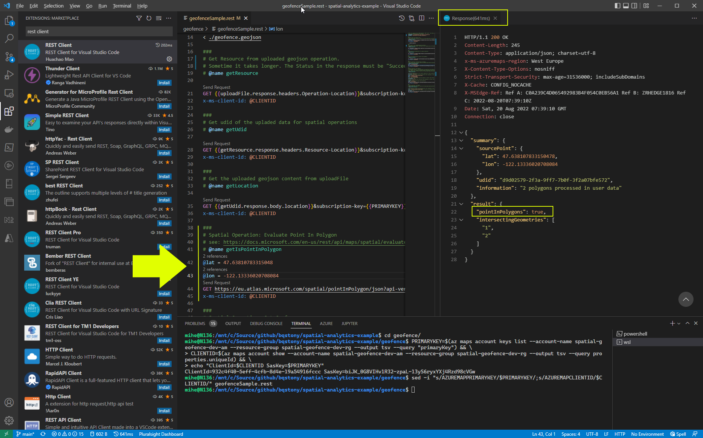

# Example of geofence by using Azure Maps

 A examples thats use the REST api for spatial analytics. 
 
 This sample use two overlapped fence areas defined in a geojson formatted file. Then we call some spatial analytics request against this geofence.

## Tools

The following Tools are required and must be installed:

- [Azure CLI](https://docs.microsoft.com/en-us/cli/azure/install-azure-cli)
- [VS Code](https://code.visualstudio.com/download)
  - [Extension: REST Client](https://marketplace.visualstudio.com/items?itemName=humao.rest-client) required to splay with `.rest` files.
- [geojson.io](https://geojson.io) when you want edit the geojson file.
- [epsg.io](https://epsg.io/map#srs=4326&x=-122.13336020708084&y=47.63810783315048&z=20&layer=osm) helps to find the right coordinate for playing with the requests

## Setup

1. Execute the following bash commands to setup Azure Maps Account:

```bash
# create Ressource Group
az group create --name spatial-geofence-dev-rg --location switzerlandnorth

# Create Azure Maps accounts (Geofence API requireses region=Global)
az maps account create --account-name spatial-geofence-dev-am --resource-group spatial-geofence-dev-rg --kind Gen2 --sku G2 --accept-tos
```

2. Replace your account information in the `geofence.geojson` with the bash script:

```bash
# Get the Azure Maps secrets
PRIMARYKEY=$(az maps account keys list --account-name spatial-geofence-dev-am --resource-group spatial-geofence-dev-rg --output tsv --query "primaryKey") && \
CLIENTID=$(az maps account show --account-name spatial-geofence-dev-am --resource-group spatial-geofence-dev-rg --output tsv --query properties.uniqueId) && \
echo "ClientId=$CLIENTID SasKey=$PRIMARYKEY"

# Update the .rest file with the Azure Map secrets
sed -i "s/AZUREMAPPRIMARYKEY/$PRIMARYKEY/;s/AZUREMAPCLIENTID/$CLIENTID/" geofenceSample.rest
```

## Play with the example

We use the geojson file [geofence.geojson](geofence.geojson) thats define 2 Polygon areas. Be aware of the `validyTime`, see [Azure Maps Geofencing](https://docs.microsoft.com/en-us/azure/azure-maps/geofence-geojson)

Open the file [geofenceSample.rest](geofenceSample.rest) in Visual Studio Code with the VS Code Extension [REST Client](https://marketplace.visualstudio.com/items?itemName=humao.rest-client). Then you can easy execute the REST commands to test it. First upload the geojson file and send the following request to get the udid thats identify the Operations target.

There are more details about the operations in the [REST API](https://docs.microsoft.com/en-us/rest/api/maps/spatial) documentation.



> Go to [geojson.io](https://geojson.io) to modify the file and play around.

## Cleanup

```bash
# Delete resource group
az group delete --yes --no-wait --name spatial-geofence-dev-rg
```


## docs

- [Azure Maps - Spatial Geofence](https://docs.microsoft.com/en-us/rest/api/maps/spatial/get-geofence?tabs=HTTP)
- [Azure Maps - Data V2 - Upload](https://docs.microsoft.com/en-us/rest/api/maps/data-v2/upload?tabs=HTTP)
- [Azure Maps - Geofencing GeoJSON data](https://docs.microsoft.com/en-us/azure/azure-maps/geofence-geojson)
- [Docs Tutorial: Implement IoT spatial analytics by using Azure Maps](https://docs.microsoft.com/en-us/azure/azure-maps/tutorial-iot-hub-maps). This sample uses events to send a e-mail when someone entere or exit the areas.