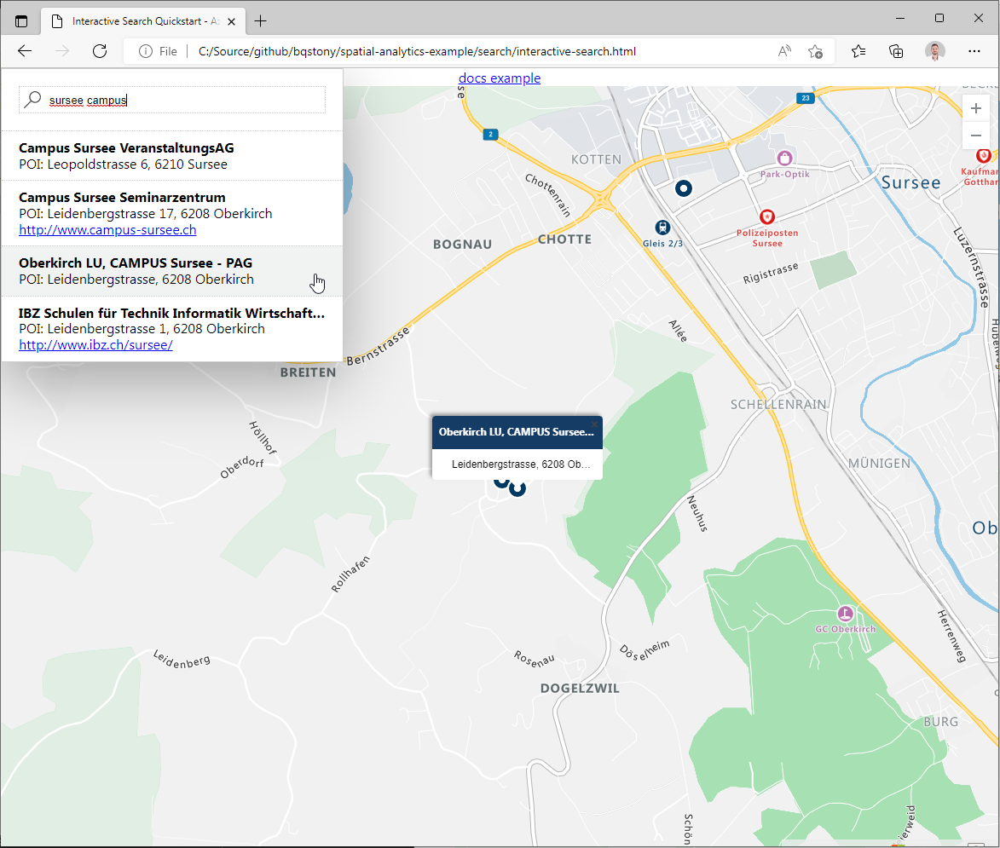

# Example of search web app by using Azure Maps

A simple local web app written in javascript to demonstrate the interactive search experience.

This sampel demonstrates how to setup a azure maps account and modify the given webfile `interactive-search.html` for acces to your own account.

## Tools

The following Tools are required:

- [Azure CLI](https://docs.microsoft.com/en-us/cli/azure/install-azure-cli)

## Setup

1. Execute the following bash commands to setup Azure Maps Account:

```bash
# create Ressource Group
az group create --name spatial-geofence-dev-rg --location switzerlandnorth

# Create Azure Maps accounts (Geofence API requireses region=Global)
az maps account create --account-name spatial-geofence-dev-am --resource-group spatial-geofence-dev-rg --kind Gen2 --sku G2 --accept-tos
```

2. Replace your account informations in the `interactive-search.html` with the bash script:

```bash
# Get the Azure Maps secrets
PRIMARYKEY=$(az maps account keys list --account-name spatial-geofence-dev-am --resource-group spatial-geofence-dev-rg --output tsv --query "primaryKey") && \
CLIENTID=$(az maps account show --account-name spatial-geofence-dev-am --resource-group spatial-geofence-dev-rg --output tsv --query properties.uniqueId) && \
echo "ClientId=$CLIENTID SasKey=$PRIMARYKEY"

# Update the .html sample with the secretes
sed -i "s/CLIENT_ID/$CLIENTID/;s/SAS_PRIMARY_KEY/$PRIMARYKEY/" interactive-search.html
```

## Play with the example

Open the file `interactive-search.html` in your browser and try it out.



## Cleanup

```bash
# Delete resource group
az group delete --yes --no-wait --name spatial-geofence-dev-rg
```